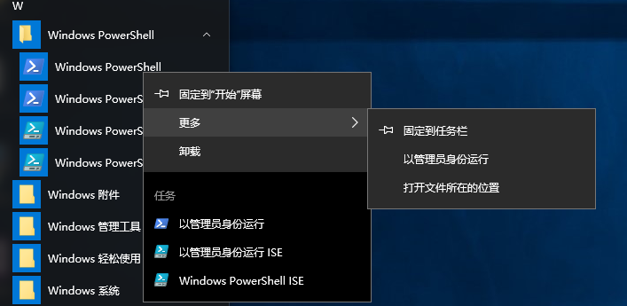
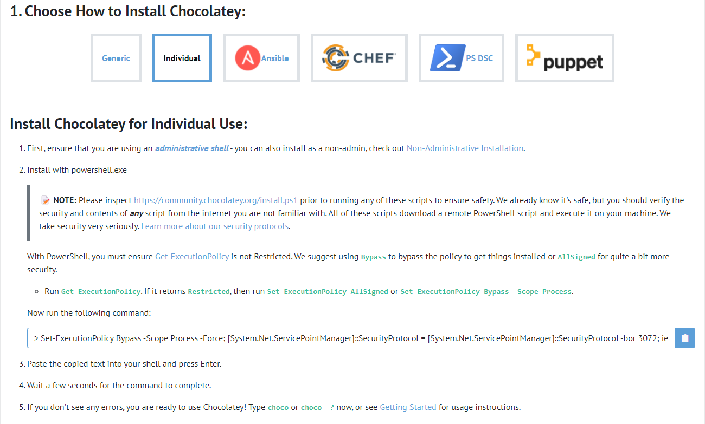
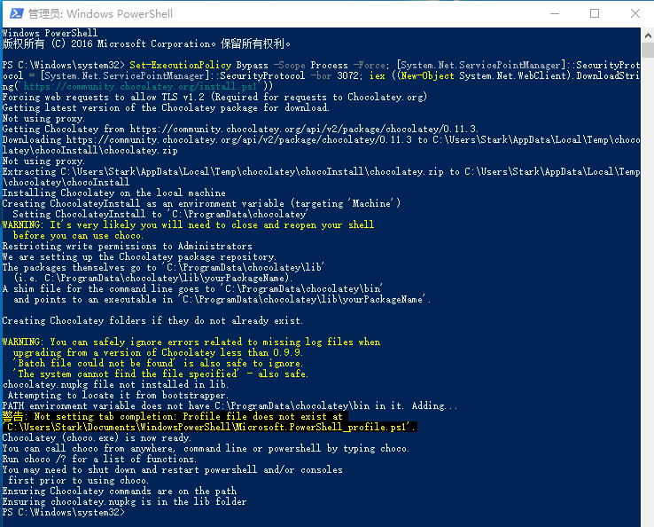
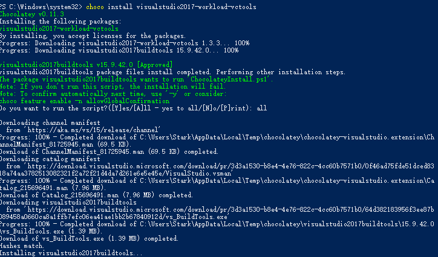

<!--
 * @Author: zym
 * @Date: 2021-12-18 11:16:20
 * @LastEditors: zym
 * @LastEditTime: 2021-12-21 10:17:56
 * @Description: 
 * @FilePath: \Destiny2 Dawning Oven\README.md
-->

# Destiny 2 Automatic Dawning Oven
还在手动接任务刷光尘？我来教你挂机！

只要材料、微光充足，躺着也能刷光尘！

这是一个基于[OpenCV-Python](https://docs.opencv.org/4.x/d6/d00/tutorial_py_root.html)和[PaddleOCR](https://www.paddlepaddle.org.cn/hub/scene/ocr)的全自动接悬赏、做饼干、领取悬赏奖励的脚本。

# 准备工作
## 安装Microsoft Visual C++ 14.0
没有Microsoft Visual C++ 14.0就无法安装后面的`paddleocr`。

我们要安装的包其实是[Microsoft Visual C++ Build Tools](http://go.microsoft.com/fwlink/?LinkId=691126)，这个库很多游戏或者工具经常用得上的，所以不要觉得麻烦啦。

因为微软的软件管理十分混乱，经常404（例如这个就是）或者找不到链接，但又不得不用，为了方便安装所以这里选择第三方包管理工具[Chocolatey](https://chocolatey.org/install)。

直接打开，然后可以看到默认的安装方式就是使用`powershell`安装。

首先在开始菜单中找到`powershell`使用**管理员权限**运行。

然后复制下面这个框框里面的这段命令：

    Set-ExecutionPolicy Bypass -Scope Process -Force; [System.Net.ServicePointManager]::SecurityProtocol = [System.Net.ServicePointManager]::SecurityProtocol -bor 3072; iex ((New-Object System.Net.WebClient).DownloadString('https://community.chocolatey.org/install.ps1'))

到`powershell`里执行：

然后再输入：

    choco install visualstudio2017-workload-vctools

就可以正常安装了，遇到询问，直接输`all`即可。

## 安装Python
首先去[Python官网](https://www.python.org/downloads/)下载python并安装。

这里选择`3.9.5`版本的下载安装。

安装完后，打开一个`cmd`，键入`py`，有输出即表示安装成功。

## 安装Shapely
打开官网[Shapely](https://www.lfd.uci.edu/~gohlke/pythonlibs/#shapely)

因为安装的Python是`3.9.5`，所以这里选择`Shapely‑1.8.0‑cp39‑cp39‑win_amd64.whl`版本的下载。

下载后，到下载的文件夹里，按住`shift`加上鼠标`右键`，打开`终端`或者`powershell`:

输入：

    py -m pip install Shapely‑1.8.0‑cp39‑cp39‑win_amd64.whl

安装完毕后，终端不要关，还有东西需要安装。

## 修改pip源

修改`pip`的源为`阿里云源`输入：

    py -m pip config set global.index-url https://mirrors.aliyun.com/pypi/simple/

然后更新`pip`

    py -m pip install --upgrade pip

## 安装PaddleOCR
等Shapely安装完后，再输入：

    py -m pip install paddlepaddle -i https://mirror.baidu.com/pypi/simple 

等待安装完毕，再输入：

    py -m pip install "paddleocr>=2.0.1"
    
等待安装即可。

## 安装依赖
首先把项目下载，然后打开项目目录，在目录按住`shift`加上鼠标`右键`，打开`终端`或者`powershell`，输入：

    py -m pip install -r requirements.txt

安装完毕后，终端不要关。

## 截图
既然是基于[OpenCV-Python](https://docs.opencv.org/4.x/d6/d00/tutorial_py_root.html)，那么截图肯定又是必不可少的。

我用的是`2k分辨率全屏`截的图，如果你也是`2k分辨率全屏`那么**可能**不需要重新截图（是可能，如果发现不太正常，建议还是重新截图）。

`cookie的截图`我是按照烤炉里的顺序排序命名的，所以按顺序截图即可（具体对应关系可以看`lib/cookies.py`）。

这里再说一下其他图怎么截：

* 悬赏上限时提示----limit.png
* 曙光节NPC名字----npc.png
* 打开任务面板，上方任务两个字----taskBtn.png
* 打开任务面板，右键烤炉的图标----oven.png
* 曙光节NPC处接的光尘悬赏图标----task.png
* 曙光节光尘悬赏完成图标----rewards.png
* 进入烤炉第一行第一个框----frameBtn.png
* 进入烤炉选择饼干上一页按钮----preBtn.png
* 进入烤炉选择饼干下一页按钮----nextBtn.png
* 给曙光节NPC送饼干时礼物图标----gift.png
* 给曙光节NPC送饼干鼠标悬停礼物上时饼干的名称----evaGift.png

## 游戏按键设置
在游戏的键盘设置里，拉到最下面，将打开任务的按键设置为`f2`。

当然也可以用别的键，在项目里的`main.py`搜索`f2`修改即可。

# 使用
做了那么多准备工作，终于可以开始使用了。

## 接悬赏刷光尘
在项目目录按住`shift`加上鼠标`右键`，打开`终端`或者`powershell`，输入:

    py ./main.py

然后切换回游戏，打开`曙光节NPC`界面，然后按一下`F3`即可开始，当需要结束时，按一下`F4`即可。

## 只做一种饼干
需要打开项目目录下的`main.py`，然后在文件开头找到`single = ''`，修改为目标饼干即可。

例如最容易做的老九饼干：

修改完后再启动脚本。

然后进入烤炉，再按一下`F3`即可开始，结束时再按一次`F4`即可。